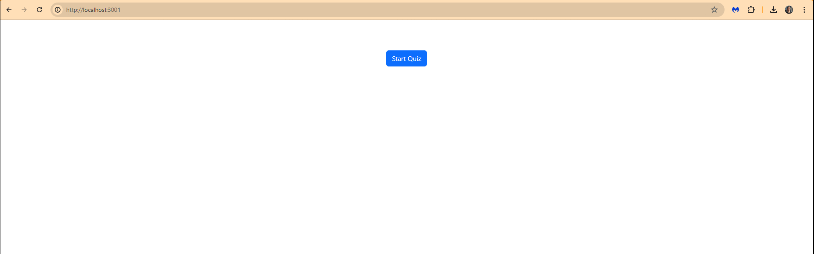

# 19 Testing: Tech Quiz Test Suite

[1. Your Task](#Your-Task)  
[2. Your Task](#User-Story)  
[3. Your Task](#Acceptance-Criteria)  
[4. Your Task](#Mock-Up)  
[5. Your Task](#Getting-Started)  
[6. Your Task](#Installation)  
[7. Your Task](#Review)  
[8. Your Task](#License)  


## Your Task

Your assignment this week underscores the importance of ensuring reliability and robustness in modern web applications through comprehensive testing. In today's dynamic development environment, testing is not just an afterthought but a critical part of the development process that ensures applications meet user demands and perform efficiently under various conditions.

This week, you'll take the starter codebase of a fully functioning Tech Quiz application and enhance it by adding Cypress for both component and end-to-end tests. The app was built using the MERN stack with a React front end, MongoDB database, and Node.js/Express.js server and API. It allows users to take a quiz of ten random questions and view their final score.

To complete the assignment, you’ll need to do the following:

1. Install Cypress as a dev dependency

2. Configure Cypress for both component and end-to-end testing

3. Create a component test for the quiz component

4. Create an end-to-test for the quiz component

## User Story

```md
AS AN aspiring developer
I WANT to take a tech quiz
SO THAT I can test my knowledge and improve my skills
```

## Acceptance Criteria

```md
GIVEN I am taking a tech quiz
WHEN I click the start button
THEN the quiz starts and I am presented with a question
WHEN I answer a question
THEN I am presented with another question
WHEN all questions are answered
THEN the quiz is over
WHEN the quiz is over
THEN I can view my score
WHEN the quiz is over
THEN I can start a new quiz
```

## Mock-Up

The following animation demonstrates the application functionality:



## Getting Started

This Challenge combines many of the skills we've covered so far. In addition to the user story and acceptance criteria, we’ve provided some guidelines to help you get started.

Because this Challenge requires a video submission, refer to the [Full-Stack Blog video submission guide](https://coding-boot-camp.github.io/full-stack/computer-literacy/video-submission-guide) for guidance on creating and sharing a video.

**Important**: You won't need to modify code for the existing application. In this challenge, you'll only be creating tests for the existing application.

Your testing should use [Cypress](https://docs.cypress.io/guides/overview/why-cypress) to run both the component tests and the end-to-end tests. The testing will be invoked using the following command:

```bash
npm run test
```
## Installation

1. npm install
2. npm run build
3. npm run start (to connect to the localhost:3001)
4. npm run  start:dev
5. npx cypress open (to start the cypress application)


It's recommended that you start with a directory structure that looks like the following example:

```md
.
├── client/                 // the client application
├── cypress/                // Folder for Cypress
    ├── component/          // Folder for component tests
        └── Quiz.cy.jsx     // Component tests for the Quiz component
    ├── e2e/                // Folder for end-to-end tests
        └── quiz.cy.js      // End-to-end tests for the Tech Quiz
    ├── fixtures/           // Folder for test fixtures
        └── questions.json  // Mock data for testing
    └── tsconfig.json
├── server/                 // the server application
├── .gitignore
├── cypress.config.ts       // Runs the application using imports from lib/
├── package.json
├── tsconfig.json
└── README.md              // App description, link to video, setup and usage instructions           
```

**Note**: The server for this application requires environment variables to function properly. You'll need to rename the `.env.example` file to `.env`.

## Review

* The URL of your GitHub repository should have a unique name and include a README describing the project:
* email: mohsinansare@gmail.com
* https://github.com/mohsinansare/Techquiz_testing_chlng19
* https://github.com/mohsinansare/Techquiz_testing_chlng19/blob/main/README.md

---
© 2024 edX Boot Camps LLC. Confidential and Proprietary. All Rights Reserved.
